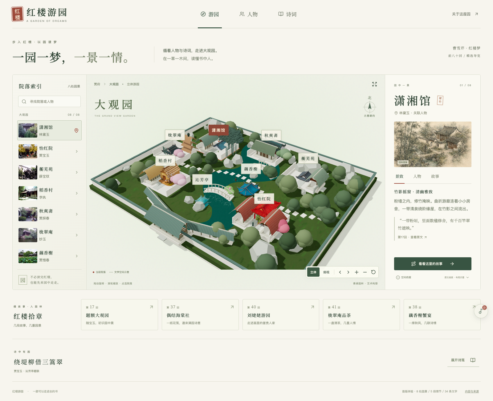
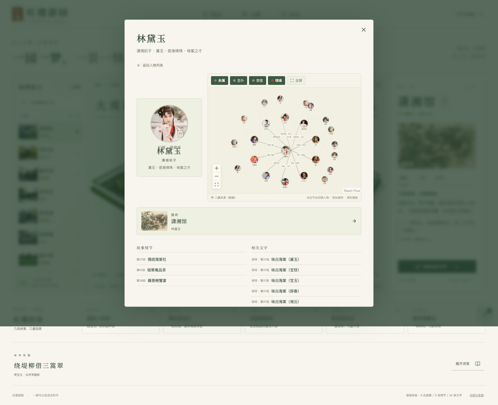
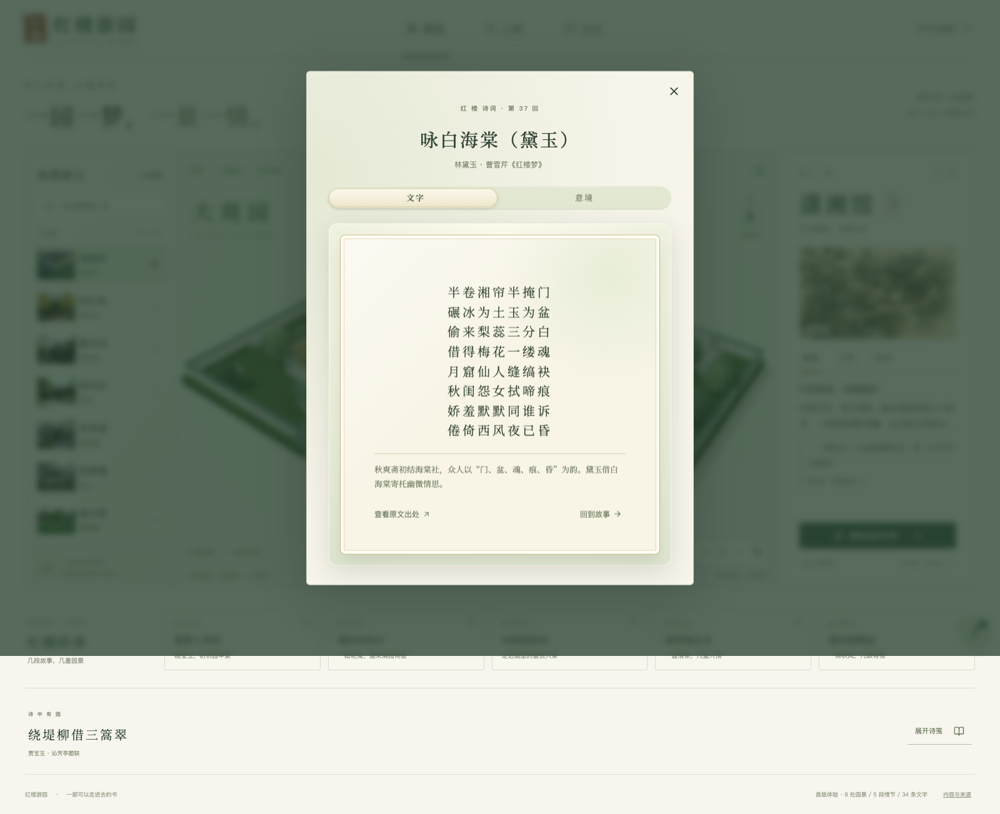

# 红楼游园 · Honglou Garden

> 获得 **2026 数字艺术黑客松「最有爱」奖**

红楼游园是一件面向普通读者的《红楼梦》数字阅读作品。它把人物、情节、园林空间与诗文放进同一条探索路径：从一位人物或一段故事进入，在可旋转的立体园林中找到地点，再回到相关的文学文本。

## 产品体验

- **游园**：在青绿园林中旋转、缩放、点选院落，切换俯视与立体视角，并沿精选故事依次游览。
- **人物**：浏览 18 位主线人物，查看身份、居所、精选情节与可筛选的人物关系。
- **诗文笺**：阅读诗词、食饮与药方条目；诗词阅读器将正文、出处与意境图放在同一处。
- **实时意境图**：打开诗词后，系统在后台生成与文本相应的意境图；生成期间不阻塞阅读，当前会话内会复用已生成结果。
- **沉浸氛围**：使用《枉凝眉》器乐版作为可控的环境音乐，支持播放与暂停。

园林、空间坐标、路线和关系图均为文学导览的艺术化呈现，不代表大观园的考证复原。文学条目与人物关系应在正式公开发行前继续按选定底本复核。

## 产品范围

| 用户问题 | 产品回应 |
| --- | --- |
| 这个人物和谁有关？ | 用可筛选关系图呈现直接关联，并提供人物详情和情节入口。 |
| 这段故事发生在哪里？ | 在游园中定位对应院落，联动地点详情与故事路线。 |
| 这首诗在什么情境下出现？ | 连接正文、人物、回目、情境说明与原文出处。 |
| 下一步看什么？ | 从当前人物、地点或诗文回到一条精选故事路径。 |

当前版本包含八处可点选园林空间、18 位主线人物、五段精选情节，以及诗词、食饮、药方三类文学条目。它支持桌面与移动端的核心游览和阅读流程。

项目暂不覆盖全量人物谱系、前八十回逐回精读、室内建模、自由行走、VR/AR、账号、社区或内容后台。

## 运行截图

### 立体游园



### 人物与关系



### 诗文阅读



## 本地运行

需要 Node.js 22.12 或更高版本。

```sh
cp .env.example .env.local
# 在 .env.local 中填写 OPENAI_API_KEY
npm install
npm run dev
```

浏览器访问 `http://localhost:5173`。

```sh
npm run build
npm run test
npm run screenshots
```

诗词意境图在服务端调用图片生成接口；密钥只应保存在 `.env.local` 或部署平台的环境变量中，不能提交到仓库。公开服务只接受项目内已收录的诗词 ID，并设置来源、频率、并发和超时限制。

## 内容边界

- 园林建筑、空间坐标、人物关系与导览路线是艺术示意，应与原文事实区分理解。
- 文学条目在公开发行前仍需依据选定底本复核出处、归属和解释。
- HonglouData 仅作为功能和内容线索参考，本项目未直接复用其数据、图片或代码。
- 图片、音频、模型和字体需要独立维护来源与授权记录。

## 技术方案

| 能力 | 实现 |
| --- | --- |
| 前端 | React、TypeScript、Vite |
| 园林互动 | Three.js、React Three Fiber、Drei |
| 人物关系 | React Flow |
| 基础交互 | Radix Primitives、Lucide |
| 内容 | 静态内容目录与稳定 ID 关联 |
| 意境图 | Vercel Function + GPT Image 2 |
| 验证 | Vitest、Playwright、真实 Chrome |

## 项目结构

```text
src/domain           文学导览的领域模型与规则
src/application      检索、关系子图、情节联动与意境图用例
src/infrastructure   已整理的静态内容目录
src/ui               React 页面、Three.js 园林与交互组件
api                  部署端的诗词意境图接口
public               运行所需的园林模型、音频与静态素材
tests                领域与浏览器交互测试
```

项目采用轻量 DDD 边界：内容和导览规则独立于界面与 Three.js 表现层；界面只组合用例和展示资产。Vercel 通过 GitHub 的 `main` 分支自动构建，生产环境只需在项目设置中配置 `OPENAI_API_KEY`。

## 维护约定

- 只保留运行、验证和维护当前产品所需的源文件与资产；构建结果、测试报告、原始生成任务记录不进入仓库。
- Git 提交信息使用中文；提交与推送由项目方决定。
- GitHub 仓库与 Vercel 项目统一命名为 `honglou-garden`。
- 生产密钥只存放在 Vercel Environment Variables，本地密钥只存放在 Git 忽略的 `.env.local`。
