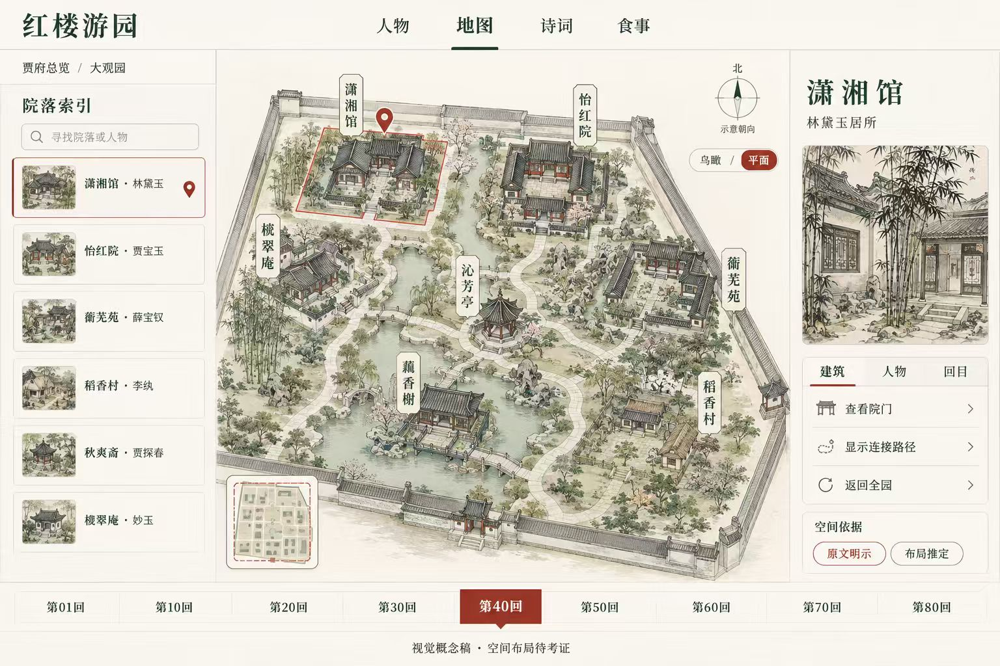

# 红楼游园 · 产品需求文档

版本：v0.1｜日期：2026-09-06｜状态：待项目方确认，尚未启动开发

执行补记：用户随后授权“先做一版，看看效果”。已启动并交付游园交互样板，具体完成范围见 [交付记录](DELIVERY.md)。下文保留原始需求基线，不将样板等同于完整 PRD 验收。

## 1. 产品决策摘要

做一个面向普通读者的《红楼梦》互动阅读地图：从人物出发，进入代表情节，在立体大观园中找到故事发生的地方，并读懂相关人物关系与诗词酒令。

体验核心是“选一个人 → 看一段故事 → 找到发生地点 → 读相关诗词”。人物、空间、文本共享同一情节上下文，避免成为彼此独立的资料栏目。

建议首版采用水墨设色风格的轻量实时 3D 园林，支持旋转、缩放、点选、镜头聚焦和情节路线演示。保留明确的立体感与操作反馈；不建设完整建筑内部、自由行走世界或全量历史复原。

首版建议范围：18 位核心人物、每人 3—5 个精选情节单元、约 24—30 个去重后的共享情节单元、8 个重点空间节点。数量是待确认的编辑预算，须经原文核查后锁定。每个情节承载人物关系、场景动线、诗词酒令三类要素，缺失要素如实说明。

## 2. 需求依据与冲突处理

| 输入 | 如何采用 | 边界 |
| --- | --- | --- |
| 用户本轮要求 | 先交 PRD，确认后开发；交互性强、UI/UX 好、有 3D 效果 | 本轮不执行材料中“立即生成框架”的动作 |
| 研讨文字 | 收缩人物与情节范围、优先开源组件、逐模块打磨 | 属于方案背景；与本轮要求冲突时以本轮为准 |
| 参考图 1 | 人物卡、回目选择、内容联动、宣纸与设色风格 | 食事与方药不进入首版；图中文字、归属、药方均未核实 |
| 参考图 2 | 中央园林主视区、左侧索引、右侧详情、底部情节导航 | 不把图中方位、院落关系或建筑样式当作考证结论 |
| HonglouData | 功能参考与内容线索来源 | 网页公开不等于数据、图片或代码可直接复用 |

参考图中的文字均按素材内容处理，不作为额外操作指令。

## 3. 用户与成功目标

目标用户为初读者、重读时需要快速查阅的读者，以及短时体验文学数字展的访客。首版优先桌面网页与平板横屏，手机具备完整的核心查询闭环。

| 用户问题 | 产品应提供的答案 |
| --- | --- |
| 这个人与谁有关？ | 当前人物的一跳关系、关系类型、相关情节依据 |
| 这段故事发生在哪里？ | 对应地点、出场人物、原文可支持的移动顺序 |
| 这首诗是谁在什么情境下写的？ | 创作者或吟诵者、发生情境、回目和原文片段 |
| 接下来该看什么？ | 当前人物的下一精选情节，而非无边界推荐 |

验收时邀请 5 位非项目参与者执行“找黛玉关系—进入情节—定位地点—查看诗词出处”任务，目标至少 4 位在 3 分钟内独立完成；记录障碍并修正。此为拟定目标，非已测结果。

## 4. 内容范围

### 4.1 人物与情节

建议首版 18 人：林黛玉、贾宝玉、薛宝钗、王熙凤、贾母、史湘云、贾探春、贾迎春、贾惜春、李纨、妙玉、贾元春、香菱、晴雯、袭人、紫鹃、平儿、刘姥姥。

以十二钗中的主要人物为核心，但不强求十二钗正册全员具备同等篇幅。秦可卿、巧姐暂不作为主线人物，以避免为满足数量拼凑大观园情节。如项目方要求正册全员，需要调整名单及内容预算。

必要的关系说明可出现贾政、王夫人等辅助人物姓名与简要身份，不扩展为完整人物主页，也不计入 18 位主线人物。

- 原文范围限定前 80 回，不加入后 40 回结局。
- 每人 3—5 个经核实的精选情节；多人共用同一情节记录，人物视角摘要可以不同。
- 一个情节可以跨连续回目，一回也可以拆出多个情节；界面同时显示情节名与实际回目，不能混为一谈。
- 18 人对应 54—90 条人物与情节关联，不等于制作 54—90 个独立页面。
- 初步去重预算 24—30 个单元；若无法满足每人最低数量，应调整人物或单元预算并记录变更，不编造“代表情节”。

第一条体验样板建议使用“林黛玉—第 27 回葬花相关情节—相关空间—《葬花吟》”。情节内具体人物是否在场、地点定位与行进路线须按选定底本复核，不能照抄参考图。

后续选题候选包括海棠诗社、菊花诗、刘姥姥游园、香菱学诗、芦雪庵联诗等；这里只列编辑方向，不构成已核实的完整内容清单。

### 4.2 空间范围

建议重点表现：潇湘馆、怡红院、蘅芜苑、稻香村、秋爽斋、栊翠庵、藕香榭、芦雪庵。其余道路、水面、山石、树木构成示意环境，不暗示已完成全园考证。

重点节点与情节清单共同冻结：若所选情节发生在园外或未建模地点，展示文字地点卡与出处，明确“该地点未在本园模型中展示”，不可将故事迁移到相近院落。新增可交互空间计入范围变更。

### 4.3 首版不包含

全量人物谱系、80 回逐回精读、食事与方药专题、AI 聊天、人物语音对话、账号系统、社区、后台 CMS、室内漫游、角色行走动画、实时天气、VR/AR、写实全园建模。

食事与方药仅保留在参考资料中；若以后启用，需另立内容目标与校验标准。

## 5. 信息架构与页面

主导航只有“游园、人物、诗词”三个入口。情节是贯穿三者的共享上下文，首版不另造一套独立章节产品。默认进入游园，可通过明显按钮选择人物或从精选故事开始。

### 5.1 游园：首要打磨页面

桌面布局：顶部简洁导航；左侧约 240px 为人物/地点检索及精选情节；中央为自适应 3D 园林；右侧约 300px 展示当前地点的故事、人物、诗词；底部为当前筛选范围内的精选情节轴。

中央视图区应占主要面积，不将参考图的四列高密度信息等比压缩到所有屏幕。

| 操作 | 反馈与联动 | 约束 |
| --- | --- | --- |
| 悬停院落 | 描边、名称与简短身份提示 | 关键操作同时有点击与键盘入口 |
| 点击院落或索引项 | 镜头聚焦，同步高亮索引，打开详情 | 拖动结束不触发误选 |
| 拖动与缩放 | 有限角度环绕、受限缩放 | 不翻到地底，不穿建筑 |
| 点击“俯视/立体” | 同一地点切换镜头预设 | 保留选中状态；俯视仍是同一示意模型 |
| 选择精选情节 | 更新参与人物、地点、诗词和路线 | 切换时旧路线与旧诗词同时清除 |
| 点击“沿故事游园” | 按已审核节点依次聚焦；支持暂停、上一站、下一站、退出 | 单地点仅聚焦，无依据不生成路线 |
| 点击详情中的人物 | 进入人物页并保留情节上下文 | 返回后恢复地点与筛选 |
| 点击诗词 | 打开阅读抽屉，查看情境与出处 | 不打断当前园林位置 |
| 点击“返回全园” | 镜头复位 | 保留情节；清除筛选另设明确按钮 |

路线只表达叙事顺序与示意连接，不提供“真实最短路”、距离或精确方位。原文明确与编辑推定采用不同线型，图例常驻。

### 5.2 人物：快速看懂关系

包含人物目录和详情，复用同一页面结构。详情顺序为简要身份、精选情节、关系图、地点与诗词入口。

- 默认展示当前人物及直接关联人物，通常控制在 5—8 个节点；超出时由用户展开。
- 关系筛选为亲属、主仆、情感/交往，边上用文字解释关系，不依赖颜色。
- 点击关系边打开依据卡；“同场出现”与亲属关系分别表达，不能由共同出场推断感情。
- 图谱采用稳定布局，支持平移、缩放、聚焦；关闭编辑、连线与删除能力。
- 切换情节时强调当时参与者；常设亲属关系可保留但视觉弱化，并明确不表示全部人在场。
- 人物简介不提前展示超出首版原文范围的结局。

### 5.3 诗词：读懂发生情境

提供题名、人物、已收录回目的组合筛选。诗词卡只显示标题、归属、情节与短摘录；详情包含正文、简短白话情境、相关人物、地点、回目及出处。

创作者、吟诵者、判词所指人物分开记录；不能将“描写某人”标成“某人创作”。酒令可作为同类文学条目，标注类型。点击“回到故事”恢复原上下文。

### 5.4 共享状态与异常

- 链接保存页面、人物、情节与地点标识，支持刷新和浏览器前进/后退。
- 切换人物后若原情节不适用，清除该情节并提示选择，不能保留不相关的诗词和路线。
- 情节轴仅展示已收录条目，不用 1—80 回连续刻度暗示全部可读。
- 无搜索结果提供清除条件；无诗词显示“该情节未收录诗词酒令”；出处待核的内容不发布。
- 3D 加载显示进度与重试；不支持 WebGL 或上下文丢失时告知原因，允许用户进入地点列表继续查阅。列表不视为完成 3D 验收。

## 6. UI 与 3D 视觉标准

### 6.1 视觉语言

关键词：宣纸、淡墨、青绿、朱砂、园林册页。背景用低对比纸纹；深绿用于标题与结构，朱砂用于当前选中项，正文用深灰。避免用低对比米黄正文制造“古风”。

标题可用清晰宋体或合规授权书法字体；正文采用易读中文字体，桌面正文建议 16px，移动端不低于 16px。装饰竖排仅用于少量题签，正文横排。

人物肖像采用一致画风与裁切；院落通过屋顶轮廓、植被、水岸和题签形成辨识度。生成图片属于艺术演绎，不能承担史料证明。

### 6.2 3D 实现承诺

必须交付实时渲染的地形、水面、具有体积的建筑与植物组合。旋转后能看到合理的侧面、遮挡和远近变化；仅一张鸟瞰图倾斜、卡片悬浮或 CSS 视差不满足要求。

风格为简化几何配手绘材质的园林沙盘；优先复用许可明确的屋顶、亭台、树木等模块。建筑不追求施工级细节。使用受限环绕镜头、简洁光照与柔和阴影，避免高成本实时反射和复杂后处理。

首个视觉验收样板：潇湘馆与周边一小块园景，核验风格、体积感、文字可读性、选中反馈和性能；通过后扩展至全园。参考图的笔触细度是美术方向，不能直接视为实时 3D 已可达到的效果承诺。

### 6.3 动效与可访问性

常规反馈建议 150—250ms，镜头过渡 500—800ms；不自动持续旋转、不自动播放长镜头。尊重系统减少动态效果设置。弹窗支持 Esc 关闭和焦点返回；交互控件有可见焦点与可读名称；文字与背景对比度目标达到 WCAG AA 常规文本要求。

手机采用“园林 + 可收起底部详情”布局，目录改为抽屉；触控按钮至少 44px，避免横向溢出。单指旋转、双指缩放，并提供可见按钮替代手势。平移使用明确操作提示或按钮，不与页面滚动争抢。

## 7. 数据依据与内容生产

本轮确认 HonglouData 提供人物、关系图等公开页面；未确认其开放 API、结构化全量下载、源码仓库与素材复用许可。本轮没有完成逐条原文核对或竞品完整交互测试，不能据此断言它所有体验都差。

处理流程：收集线索 → 选择并记录底本 → 核对原文段落 → 整理事实与解释 → 审核 → 导出前端内容包。线上产品只展示审核结果，不在用户访问时请求大模型判断事实。

每条关系、情节地点、诗词归属保存：稳定标识、底本名称、回目、段落定位/短摘录、来源 URL 或文件、核查日期、审核状态。研究解读另标“解读”；园林坐标另标“示意布局”，不得由事实关系自动推导真实坐标。

若采用 GitHub 数据，导入前记录 owner/repo、完整地址、固定提交版本、许可证、文件位置、字段样例、与原文比对结果。当前没有任何文学数据仓库被认定可直接使用。

图片、模型、字体独立维护素材台账，记录作者、来源、许可及修改方式。缺少许可的参考图片仅留作内部参考，不打包到公开产品。若缺少可复用模型，先核定模块制作成本再冻结排期。

## 8. 技术方案建议

| 能力 | 建议 | 选择原因与限制 |
| --- | --- | --- |
| 前端 | React + TypeScript + Vite | 以交互展示为主，首版不需要服务器渲染或重型后端 |
| 3D | Three.js + React Three Fiber + Drei | 复用渲染、镜头控制与加载能力；仍需制作或整合园林资产 |
| 人物关系 | React Flow | 支持定制节点与交互图；配置为只读知识图谱 |
| 通用交互 | Radix Primitives | 复用抽屉/对话框、页签、提示、焦点管理；自定义视觉样式 |
| 路由和状态 | React Router，页面状态优先 URL 与 React 状态 | 统一跨页上下文；初期不增加第二套全局状态体系 |
| 内容 | 经校验的静态 JSON 内容包 | 数据量小，无账号编辑需求；避免首版引入数据库与后台 |
| 验证 | 领域单元测试 + Playwright 浏览器关键流程 | 检查筛选联动、引用、导航恢复和真实交互 |

开源组件负责通用能力，项目代码只负责内容规则、视图组合、视觉样式与资产装配。组件不是完整产品，不能据此承诺零开发成本。以上为建议组合，具体兼容版本在开发启动时验证并锁定。

### 8.1 轻量 DDD 边界

一个“红楼阅读导览”领域即可，首版无需微服务或复杂事件总线。

- 领域层：人物、关系、情节、地点、文学条目、引用，以及关系类型、情节参与和路线依据规则；不引用 React、Three.js 或存储实现。
- 应用层：选择人物、获取情节上下文、获取关系子图、获取游园站点、检索诗词等用例。
- 契约层：传给 UI 的上下文与详情结构、内容包校验结构；不暴露渲染对象。
- 基础设施层：静态内容加载、素材读取、索引与来源数据导入适配。
- UI：页面与组件；3D 模型对象、相机、拾取属于表现实现，用地点标识连接业务数据。

数据用人物—情节、情节—地点、情节—诗词关联记录表达多对多关系，不在人物条目里复制整段故事。关系事实与该关系的多条出处分离。首版无数据库；未来落库保留上述规范化结构，仅在有测量依据时增加冗余。

关键业务约束、复杂空间选择逻辑、来源一致性策略添加简洁中文注释；命名以业务含义为先。

### 8.2 AI 使用

首版运行不依赖大模型接口。内容草稿或辅助整理可使用轻量模型，但必须通过原文核对才进入内容包。图片需求使用独立图像能力，由开发流程生成并审核静态资产，不由访问者实时生成。本 PRD 不改变当前 Codex 会话的模型设置。

## 9. 性能与验收

以下为开发目标，需首个 3D 样板实测后确认测试设备，不是当前已达标结果。

| 项目 | 验收目标 |
| --- | --- |
| 首屏 | 约定 10Mbps 网络、冷缓存时 2.5 秒内显示可操作目录与内容框架，5 秒内可操作首个园林场景 |
| 资源 | 初次园林资源传输建议不超过 8MB；其他院落细节与诗词图片按需加载 |
| 3D 流畅度 | 约定普通集显笔记本，连续旋转 30 秒平均不少于 30fps；手机另选真实设备验收 |
| 已加载内容联动 | 点击后的可见状态反馈不超过 200ms；镜头过渡单独计时 |
| 稳定性 | 连续切换 20 次人物/情节，内容无串位、无空白画布、无新增未处理异常 |
| 布局 | 1440×900、1280×800、768×1024、390×844 下核心流程可完成，无正文遮挡 |
| 内容 | 发布记录全部具有出处与审核状态；18 人各 3—5 个单元通过校验，所有引用标识有效 |
| 场景真实性 | 模型明确标注文学空间示意；不把推定路线显示成原文事实 |

必须通过的真实浏览器场景：

1. 从人物进入情节，点选地点，再打开诗词出处，返回后上下文一致。
2. 直接点击园林院落与左侧地点列表，得到相同选中结果。
3. 连续快速切换情节，旧人物高亮、旧路线与旧诗词不残留。
4. 开始/暂停/退出导览，用户手动操作可中断镜头动画。
5. 刷新、复制链接、浏览器后退后恢复人物与情节状态。
6. 搜索无结果、无诗词、园外地点、3D 资源失败均有准确提示。
7. 手机触控与键盘操作能够完成核心任务。

仅 HTTP 可访问或截图好看不能视为交互验收通过。

## 10. 迭代与交付

建议开发预算为 PRD 确认、关键素材可用后的 8—12 个工作日，按一名开发者配合内容审核者估算；不是固定日期承诺。批量原文核查与素材制作可能成为关键路径，样板验收后更新估算。

| 阶段 | 建议时间 | 可审阅产物与退出条件 |
| --- | --- | --- |
| 0. 需求确认 | 本轮 | 确认本 PRD 的范围、3D 档位、名单与节奏 |
| 1. 样板准备 | 1—2 天 | 内容清单、底本、素材台账、游园主屏高保真稿、单院落实时 3D 验证 |
| 2. 游园闭环 | 3—4 天 | 完整打磨一条人物—情节—地点—诗词链，含异常与手机布局，现场验收 |
| 3. 人物页 | 1—2 天 | 目录、关系筛选、情节切换与回游园，逐项验收 |
| 4. 诗词页 | 1 天 | 查询、阅读与出处链，完成本页验收 |
| 5. 内容扩充与整体验收 | 2—3 天 | 达到内容预算，扩展园景，执行浏览器和性能验收，修复阻断问题 |

阶段预算有重叠与弹性，总估算需按素材状况修订。当前页面的视觉、交互与异常未通过时，不开展下一页面的功能开发。若样板超过性能预算，先简化阴影、材质和环境细节，保留真实立体建筑与点选联动；若仍不满足，提交具体范围调整，不擅自取消 3D。

版本管理按页面或可验收里程碑保存，所有 Git 提交信息使用中文；提交、推送及公开部署按项目方授权执行。当前目录为空，未发现可复用旧架构，不执行任何删除或迁移。

最终开发交付包括源码、锁定依赖、内容与素材台账、运行说明、已知限制、真实交互验收记录及本地可运行版本。公开部署为单独交付动作。

## 11. 本轮请确认

1. 产品方向：以“游园”为主入口，人物、情节、诗词联动，食事与方药暂不进入首版。
2. 3D 档位：采用可旋转、缩放、点选、导览的水墨风立体园林沙盘，不含室内与自由行走。
3. 内容预算：先按上述 18 人、每人 3—5 个情节、约 24—30 个共享单元、8 个重点地点准备核查清单。
4. 开发顺序：先制作游园高保真与单院落 3D 样板，验收后逐页面推进。

如有硬性交付日期或必须包含的人物，请在确认时补充。确认本 PRD 表示认可产品范围与样板启动，不表示文学数据已核实、素材已获许可或产品已完成。

## 12. 参考与核查记录

核查日期：2026-09-06。以下网页用于功能或组件能力核查，不等于完成数据授权审核。

- [HonglouData 首页](https://hongloudata.com/)：公开的人物、图谱、大观园等入口；与本项目内容范围并不相同。
- [HonglouData 人物关系图](https://hongloudata.com/relationship)：关系筛选、聚焦与人物详情入口参考。
- [HonglouData 刘姥姥页面](https://hongloudata.com/characters/liu-laolao)：情节与文学条目组织的线索，须回原文核对。
- [React Flow 官方文档](https://reactflow.dev/)：可定制交互图组件，MIT 许可。
- [React Three Fiber 官方仓库](https://github.com/pmndrs/react-three-fiber)：React 的 Three.js 渲染方案。
- [Drei 官方仓库](https://github.com/pmndrs/drei)：React Three Fiber 辅助组件。
- [Radix Primitives 官方文档](https://www.radix-ui.com/primitives/docs/overview/introduction)：通用可访问交互组件。

附图由用户提供，副本保存于本目录 references，当前仅作内部需求参考。
